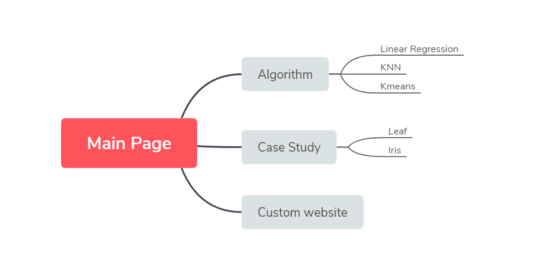

## Introduction

From the late 1980s to the 21st century, people studied a variety of machine learning methods, including neural networks, biology and evolution techniques, and mathematical modeling. But the most successful are still various algorithms developed based on statistics such as KNN, Kmeans, etc. These algorithms often require a lot of mathematical derivation. The purpose of establishing this website is to hope that people without rich statistical knowledge can learn and understand machine learning through graphical interaction and case study.

## Project architecture
As shown in the figure, our project can be divided into three modules.


```{r, out.width = "400px", echo=FALSE}

```

Now I will explain these three modules in detail.

* Algorithm

  In this module, we have 1 page for each Algorithm. First we will have some text descriptions and mathematical formulas, so that users can have some basic understanding of the algorithm. Then we will have an interactive image, users can generate data to perform these algorithms. This step is crucial to enable users to have a deeper understanding of these algorithms
  
* Case Study

  In this module, we will perform a series of analysis, visualization, classification and other operations on those classic data sets. Users will have a clear understanding of the application of machine learning based on these cases.

* Custom Website
  
  The most important part, in this module, users can upload their own data sets, and analyze them through the options given on the page. Of course, we will require the user to upload the data set, such as our maximum number of columns, maximum number of rows, and so on. We will explain in detail later. In this module, users can deepen their understanding of machine learning through their own data sets.


## Tool introduction

### Web Design

* Vue
  
  Vue is a progressive framework for building user interfaces. Unlike other large frameworks, Vue is designed to be applied layer by layer from bottom to top. Vue's core library only focuses on the view layer, which is not only easy to get started, but also easy to integrate with third-party libraries or existing projects. On the other hand, when combined with a modern tool chain and various support libraries, Vue is also fully capable of driving complex single-page applications. **The most important thing is that Vue is a responsive design, that is, when our background data changes, the page will immediately change, which is very conducive to our demonstration of some algorithms.**
  
* Element-ui

  This is Alibaba's open source CSS library, which provides many webpage style designs.

* Plotly.js

  Plotly.js is a visualization library designed based on JavaScript, which can be integrated in the browser. This is very convenient for us to do interactive graphic design. At the same time it inherits from Plotly, the famous dash is based on Plotly design.


### Machine Learning Tool
The following are all machine learning algorithm libraries designed based on JavaScript.

* ml-regression-simple-linear

* ml-kmeans

* ml-knn

* libsvm-js/asm

* ml-random-forest

* ml-cart

## Page details


