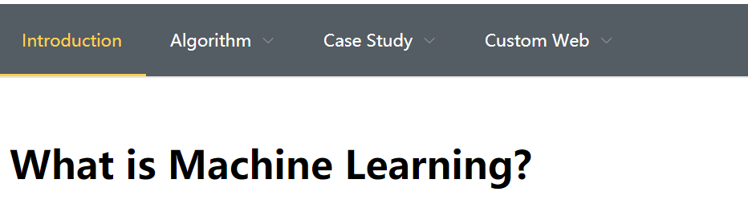
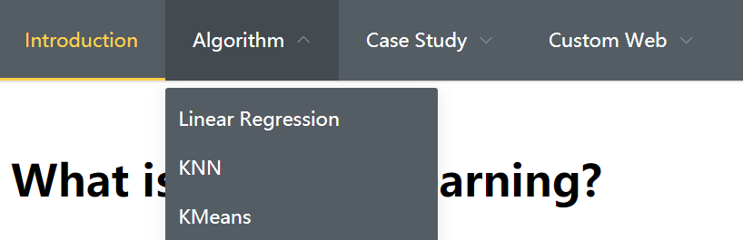
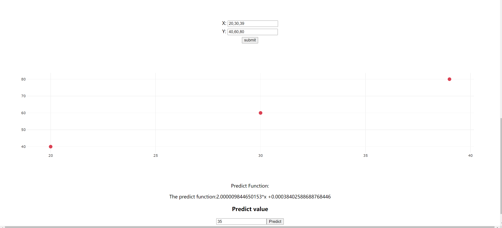
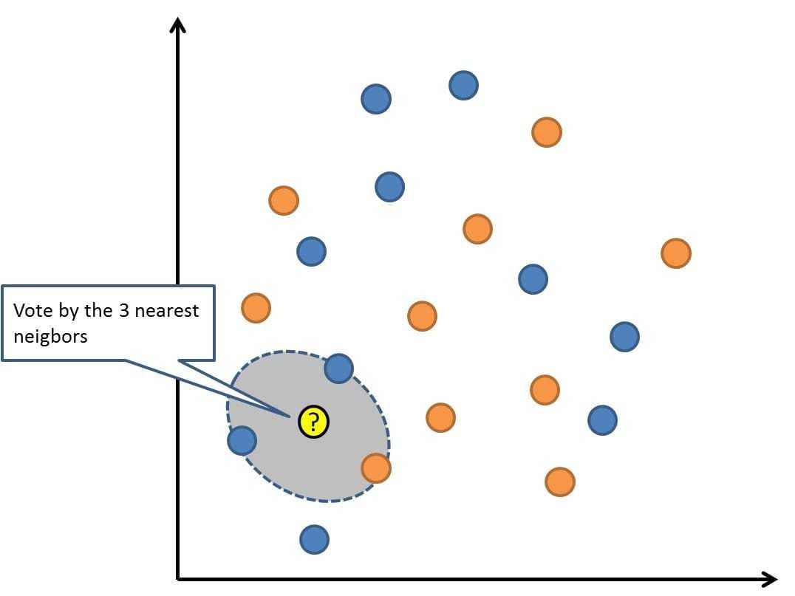
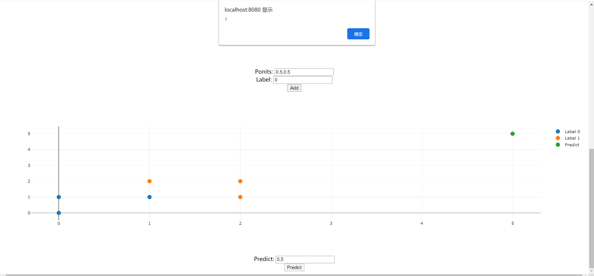
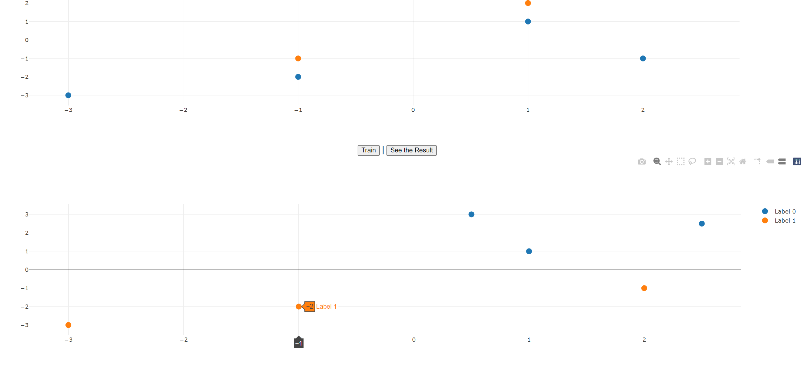

## 1. Introduction
Machine learning has actually existed for decades or can be considered to have existed for centuries. Dating back to the 17th century, Bayes and Laplace's derivation of the least squares method and Markov chains constitute the tools and foundations widely used in machine learning. From 1950 (Allen Turing proposed to build a learning machine) to early 2000 (there are practical applications of deep learning and recent progress, such as AlexNet in 2012), machine learning has made great progress.

Since the study of machine learning in the 1950s, the research approaches and objectives in different periods have been different and can be divided into four stages.

The first stage is from the mid-1950s to the mid-1960s. This period focused on "learning with or without knowledge." This kind of method is mainly to study the execution ability of the system. During this period, the data fed back by the system is mainly detected by changing the environment of the machine and its corresponding performance parameters. It is like giving the system a program. By changing their free space, the system will be affected by the program to change its own Organization, and finally this system will choose an optimal environment to survive. The most representative research during this period was Samuet's chess program. But this method of machine learning is still far from meeting human needs. 
The second stage is from the mid-1960s to the mid-1970s. This period mainly focused on implanting knowledge from various fields into the system. The purpose of this stage is to simulate the process of human learning through machines. At the same time, the knowledge of the graph structure and its logical structure is also used to describe the system. At this stage of the study, various symbols are mainly used to represent machine language. The researchers realized that learning is a long-term process when conducting experiments. In this system environment, it is impossible to learn more in-depth knowledge, so the researchers added the knowledge of various experts and scholars to the system. Practice has proved that this method has achieved certain results. The representative work at this stage includes Hayes-Roth and Winson's structural learning system approach.

The third stage, from the mid-1970s to the mid-1980s, is called the revival period. During this period, people expanded from learning a single concept to learning multiple concepts, exploring different learning strategies and learning methods, and at this stage have begun to combine the learning system with various applications and achieved great success. At the same time, the demand for knowledge acquisition by expert systems has greatly stimulated the research and development of machine learning. After the emergence of the first expert learning system, the example inductive learning system became the mainstream of research, and automatic knowledge acquisition became the research goal of machine learning applications. In 1980, the first International Conference on Machine Learning was held in Carnegie Mellon (CMU) in the United States, marking the rise of machine learning research in the world. Since then, machine learning has been widely used. In 1984, the second volume of the Machine Learning essay co-authored by Simon and more than 20 artificial intelligence experts was published, and the international magazine Machine Learning was published, which further showed the rapid development of machine learning. The representative work of this stage includes Mostow's guided learning, Lenat's mathematical concept discovery program, Langley's BACON program and its improvement program.

The fourth stage in the mid-1980s is the latest stage of machine learning. Machine learning in this period has the following characteristics:

(1) Machine learning has become a new discipline, which comprehensively applies psychology, biology, neurophysiology, mathematics, automation, and computer science to form the theoretical foundation of machine learning.
(2) A variety of learning methods have been integrated, and various forms of integrated learning systems are emerging.
(3) A unified view of various basic problems of machine learning and artificial intelligence is taking shape.
(4) The scope of application of various learning methods is constantly expanding, and some of the results of applied research have been transformed into products.
(5) Academic activities related to machine learning are unprecedentedly active.

Now I think machine learning is one of the must-have for many people. These algorithms often require a lot of mathematical derivation. The purpose of establishing this website is to hope that people without rich statistical knowledge can learn and understand machine learning through graphical interaction and case study.


## 2. Project architecture
As shown in the figure, our project can be divided into three modules.


```{r, out.width = "400px", echo=FALSE, fig.align="center"}
knitr::include_graphics("./1.png")
```

We show our web design


```{r, out.width = "400px", echo=FALSE,fig.align="center"}

```

Now I will explain these three modules in detail.

* Algorithm

  In this module, we have 1 page for each Algorithm. First we will have some text descriptions and mathematical formulas, so that users can have some basic understanding of the algorithm. Then we will have an interactive image, users can generate data to perform these algorithms. This step is crucial to enable users to have a deeper understanding of these algorithms
  
* Case Study

  In this module, we will perform a series of analysis, visualization, classification and other operations on those classic data sets. Users will have a clear understanding of the application of machine learning based on these cases.

* Custom Website
  
  The most important part, in this module, users can upload their own data sets, and analyze them through the options given on the page. Of course, we will require the user to upload the data set, such as our maximum number of columns, maximum number of rows, and so on. We will explain in detail later. In this module, users can deepen their understanding of machine learning through their own data sets.


## 3. Tool introduction

### 3.1 Web Design

* Vue
  
  Vue is a progressive framework for building user interfaces. Unlike other large frameworks, Vue is designed to be applied layer by layer from bottom to top. Vue's core library only focuses on the view layer, which is not only easy to get started, but also easy to integrate with third-party libraries or existing projects. On the other hand, when combined with a modern tool chain and various support libraries, Vue is also fully capable of driving complex single-page applications. **The most important thing is that Vue is a responsive design, that is, when our background data changes, the page will immediately change, which is very conducive to our demonstration of some algorithms.**
  
* Element-ui

  This is Alibaba's open source CSS library, which provides many webpage style designs.

* Plotly.js

  Plotly.js is a visualization library designed based on JavaScript, which can be integrated in the browser. This is very convenient for us to do interactive graphic design. At the same time it inherits from Plotly, the famous dash is based on Plotly design.


### 3.2 Machine Learning Tool
The following are all machine learning algorithm libraries designed based on JavaScript.

* ml-regression-simple-linear

* ml-kmeans

* ml-knn

* libsvm-js/asm

* ml-random-forest

* ml-cart

## 4. Page details

In this part, we will introduce the function of each page in detail. We will divide them into three parts, Basic Algorithm, Case Study,  Custom Page. It should be added that first of all, we will not give a detailed description of the mathematical derivation of the algorithm. Secondly, for the algorithm part, we will not carry out interactive graphic design for some algorithms that are difficult to visualize, such as random forest, etc., but we will use these algorithms in Case Study.

### 4.1 Basic Algorthim
We will introduce three linear regression algorithms, KNN and Kmeans, which are easy to design interactive graphics.

```{r, out.width = "400px", echo=FALSE,fig.align="center"}

```

#### 4.1.1 Linear Regression

Regression model is a method of statistically analyzing data, the purpose is to understand whether two or more variables are related, related direction and intensity, and establish a mathematical model to observe specific variables to predict the variables of interest to researchers. More specifically, regression analysis can help people understand how much the dependent variable changes when only one independent variable changes. In general, through regression analysis we can estimate the conditional expectation of the dependent variable from the given independent variables.

I think that linear regression is not one of the simplest algorithms in regression model. We always have a formula for linear regression.
$$ Y = \beta_0 + \beta_i * X_i +\sigma+i $$ We often use least squares to solve linear regression problems. $$\beta =\frac{1}{X^TX} X^Ty$$
We use Plot and ml-regression-simple-linear two libraries to design interactive graphics. As shown in the figure, users can generate data themselves. Our program will automatically generate graphics based on data transformation. Users can make predictions at this time. To the regression equation, and can predict any point to get the predicted value.

```{r, out.width = "600px", echo=FALSE,fig.align="center"}

```

#### 4.1.2 KNN

K-nearst neighbors (KNN) is a very basic machine learning method. Its idea is:
When the data and labels in the training set are known, enter the test data, compare the features of the test data with the corresponding features in the training set, and find the top K data in the training set that are most similar to them. The category is the category with the most occurrences in the K data.

The idea of the KNN algorithm is: If most of the k most similar samples in a feature space (that is, the closest neighbors in the feature space) belong to a certain category, the sample also belongs to this category. Generally, the value of K is relatively small and will not exceed 20.
The algorithm steps are:
  
* Calculate the distance from the unknown instance to all known instances;
* Select parameter K;
* According to the majority-voting rule, the unknown instances are classified as the largest number of categories in the sample.

There is a very famous knn classification image.
```{r, out.width = "600px", echo=FALSE,fig.align="center"}

```

The interactive graphics of the KNN algorithm will be relatively more complicated.

* We can choose the data and label to generate the image
* By clicking the prediction button, we will get the prediction result of the prompt box and the image

```{r, out.width = "600px", echo=FALSE,fig.align="center"}

```

#### 4.1.3 Kmeans
The K-means algorithm originated from a vector quantization method in signal processing, and is now more popular as a cluster analysis method in the field of data mining. The purpose of k-average clustering is to divide {\displaystyle n}n points (which can be an observation or an instance of the sample) into k clusters, so that each point belongs to the nearest mean (this That is, the cluster corresponding to the cluster center, and use it as the criterion of clustering. This problem will be reduced to a problem of dividing the data space into Voronoi cells.

The way kmeans algorithm works is as follows:

1. Specify number of clusters K.
2. Initialize centroids by first shuffling the dataset and then randomly selecting K data points for the centroids without replacement.
3. Keep iterating until there is no change to the centroids. i.e assignment of data points to clusters isn’t changing.
4. Compute the sum of the squared distance between data points and all centroids.
5. Assign each data point to the closest cluster (centroid).
6. Compute the centroids for the clusters by taking the average of the all data points that belong to each cluster.


```{r, out.width = "600px", echo=FALSE,fig.align="center"}
knitr::include_graphics("./7.png")
```

The interactive graphics of the Kmeans algorithm will be relatively more complicated than KNN.

* For more convenient operation, we fixed two initial points. We can generate data ourselves to train the model
* We need to click the training button
* Finally we can click the see the result button to generate a new picture,so that we can compare with the original graph.
```{r, out.width = "600px", echo=FALSE,fig.align="center"}

```

### 4.2 Case Study

#### 4.2.1 Iris
